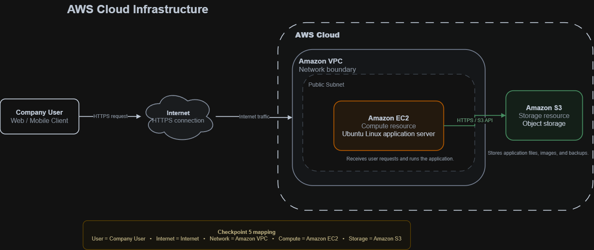
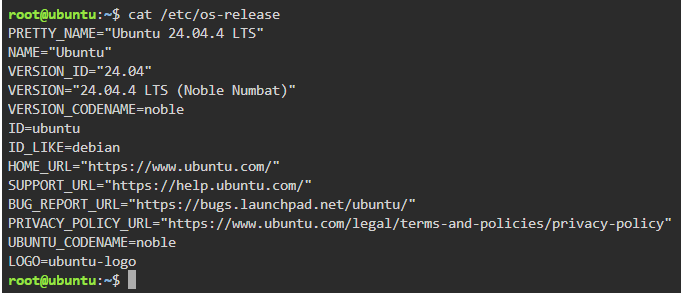
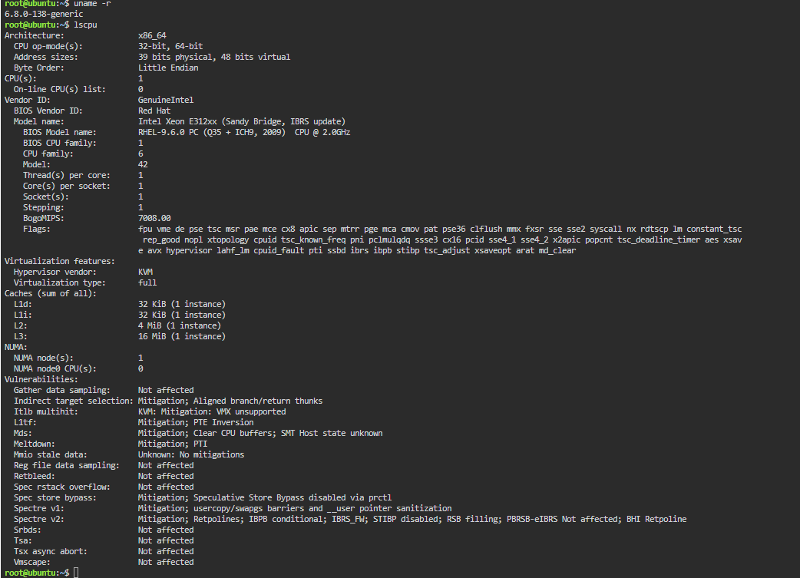
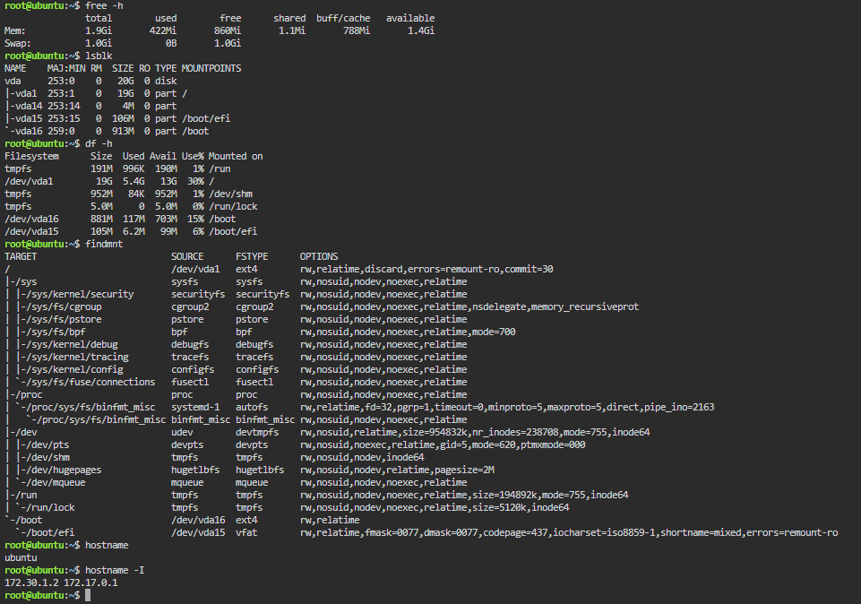

# Laboratory 02: Build the Cloud Infrastructure Blueprint

## Mission Overview

This laboratory examined the fundamental components that support cloud infrastructure and applied them to the design of a simple cloud architecture. The work progressed from inspecting a Linux-based virtual environment to explaining cloud components, comparing major cloud providers, and creating an AWS-based infrastructure diagram in Draw.io.

The completed laboratory demonstrates how operating systems, compute resources, storage, networking, identity and access management, and technical documentation contribute to a cloud infrastructure blueprint.

## Objectives

The objectives of this laboratory were to:

- Inspect and document the operating system, processor, memory, storage, filesystem, hostname, and network information of a Linux environment.
- Explain the purpose of compute, storage, networking, and operating system components in cloud infrastructure.
- Compare the equivalent services and general capabilities of Amazon Web Services (AWS), Microsoft Azure, and Google Cloud Platform (GCP).
- Select a suitable cloud provider for a fictional company infrastructure design.
- Create a cloud architecture diagram containing a user, Internet connection, network, compute resource, and storage resource.
- Present the completed work through clear, professional, and properly structured technical documentation.
- Maintain evidence of completed tasks and manage the laboratory files through Git and GitHub.

## Cloud Infrastructure Components

### Compute

Compute provides the processing capacity required to run applications, services, and workloads. It may be delivered through virtual machines, containers, serverless functions, or managed application platforms. In the infrastructure blueprint, the compute resource represents the server that receives and processes application requests.

### Storage

Storage provides persistent space for application files, user-generated content, backups, and other data. Cloud storage can take the form of object, block, or file storage depending on the workload. In the architecture diagram, the storage resource is connected to the compute layer so that the application can save and retrieve required data.

### Networking

Networking enables communication between users, cloud resources, and the Internet. A cloud network provides logical isolation and supports controlled traffic flow through addressing, routing, and security rules. In the blueprint, the network contains the cloud resources and provides a defined route from the user through the Internet to the application.

### Operating System

The operating system manages hardware resources and provides the environment in which software and services run. The laboratory environment used **Ubuntu 24.04.4 LTS**, which supplied the Linux commands and system interfaces needed to inspect the virtual infrastructure.

### Identity and Access Management

Identity and Access Management (IAM) controls who or what can access cloud resources and which operations are permitted. Good IAM design follows the principle of least privilege, where users and services receive only the permissions required to complete their tasks.

### AWS-Based Architecture Blueprint

AWS was selected as the provider represented in the Checkpoint 5 diagram. The architecture contains the five required elements:

1. A company user who accesses the application.
2. An Internet connection that carries the request to the cloud environment.
3. An AWS-based cloud network that provides an isolated boundary for resources.
4. A compute resource that hosts and processes the application workload.
5. A storage resource that retains application data.

The design was intentionally organized as a logical request flow rather than as a collection of unrelated icons. Resource boundaries, directional connectors, labels, and security-oriented annotations were used to make the diagram understandable and technically meaningful.



## Tools Used

| Tool                        | Purpose                                                                                          |
| --------------------------- | ------------------------------------------------------------------------------------------------ |
| KillerCoda                  | Provided the temporary Ubuntu Linux environment used for infrastructure inspection.              |
| Ubuntu Linux                | Served as the operating system investigated during the laboratory.                               |
| Draw.io                     | Used to design and export the AWS-based cloud infrastructure diagram.                            |
| AWS architecture components | Provided the cloud-service context and visual representation used in the architecture blueprint. |
| Zed                         | Used to create and edit the Markdown documentation.                                              |
| Git                         | Tracked changes and recorded the completion of each checkpoint.                                  |
| GitHub                      | Hosted the repository and served as the final submission location.                               |
| Windows PowerShell          | Used to execute Git commands from the local Windows environment.                                 |

## Linux Commands Executed

The following commands were executed in the KillerCoda Ubuntu environment:

| Command               | Purpose                                                                       |
| --------------------- | ----------------------------------------------------------------------------- |
| `cat /etc/os-release` | Displayed the Linux distribution name and operating-system version.           |
| `uname -r`            | Displayed the running Linux kernel version.                                   |
| `lscpu`               | Displayed CPU architecture, processor, virtualization, and cache information. |
| `free -h`             | Displayed memory and swap usage in a human-readable format.                   |
| `lsblk`               | Listed block devices, partitions, sizes, and mount points.                    |
| `df -h`               | Displayed filesystem capacity, usage, available space, and mount locations.   |
| `findmnt`             | Displayed mounted filesystems and their mount options.                        |
| `hostname`            | Displayed the hostname assigned to the Linux environment.                     |
| `hostname -I`         | Displayed the IP addresses assigned to the environment.                       |

The investigation identified the following main environment characteristics:

- **Operating system:** Ubuntu 24.04.4 LTS
- **Virtualization:** KVM
- **Processor allocation:** 1 virtual CPU
- **Memory:** Approximately 1.9 GiB
- **Primary disk:** Approximately 20 GB

### Infrastructure Evidence

#### Operating System Information



#### Processor Information



#### Memory, Storage, Filesystem, and Network Information



## Skills Learned

The laboratory helped develop the following skills:

- Collecting Linux system information through command-line tools.
- Interpreting CPU, memory, storage, filesystem, virtualization, and network output.
- Relating local infrastructure resources to their cloud equivalents.
- Explaining compute, storage, networking, operating systems, and IAM in technical terms.
- Comparing AWS, Azure, and GCP without treating differently named services as completely unrelated technologies.
- Evaluating a cloud provider according to architecture requirements instead of selecting one only because of popularity.
- Translating infrastructure requirements into a readable cloud architecture diagram.
- Applying clear labels, boundaries, connectors, and data flow to technical diagrams.
- Writing structured technical documentation in Markdown.
- Organizing evidence through relative repository paths.
- Using Git commits to document progress checkpoint by checkpoint.

## Challenges Encountered

### Interpreting Linux Command Output

One challenge was deciding which values from the Linux command output were important enough to include in the infrastructure report. Commands such as `lscpu`, `findmnt`, and `df -h` produced detailed information, but not every line was equally relevant. The output had to be reviewed carefully so that the report accurately documented the environment without becoming a copy of the terminal output.

### Matching Documentation with Screenshot Evidence

The written findings needed to remain consistent with the screenshots. This required checking operating-system, CPU, memory, storage, and network values before adding them to the report. Screenshot filenames also had to be descriptive, and the relative image paths had to match the repository structure so that the evidence would render correctly on GitHub.

### Distinguishing Cloud Components

Compute, storage, networking, and operating systems are closely connected, which initially made it challenging to explain each component without repeating the same ideas. This was addressed by describing the primary responsibility of each component and then explaining how the components work together as part of one infrastructure system.

### Comparing Cloud Providers Fairly

AWS, Azure, and GCP use different names and service structures for similar capabilities. The comparison therefore required more than matching services by name. Official documentation and general cloud concepts were used to compare compute, storage, networking, and IAM according to their purpose while avoiding unsupported claims that one provider is always superior.

### Deciding Which Cloud Provider to Use

Selecting a provider for the architecture diagram was another challenge because AWS, Azure, and GCP could all satisfy the basic requirements. AWS was ultimately selected to create a consistent provider-specific design. The decision made it possible to use one recognizable cloud ecosystem instead of mixing symbols and concepts from different providers.

### Creating the Cloud Architecture Diagram

The diagram was one of the most challenging parts of the activity. It was necessary to include all five required components while avoiding a diagram that looked too simple, crowded, or visually generic. Considerable attention was given to component placement, connection direction, labels, network boundaries, and the relationship between compute and storage. Draw.io made the design editable, but arranging the elements into a technically logical and visually balanced architecture required several design decisions.

### Balancing Simplicity and Technical Detail

Adding more technical elements could make the diagram look more realistic, but unnecessary complexity could hide the checkpoint requirements. The final approach preserved a clear user-to-Internet-to-network flow while adding only details that improved the explanation of the design. This kept the architecture suitable for the activity while demonstrating a software-engineering perspective.

### Maintaining Repository Consistency

Another challenge was keeping report names, screenshot names, relative paths, and commit messages consistent across multiple checkpoints. A clear repository structure and checkpoint-specific commits were used to make the work easier to review and prevent evidence files from becoming disconnected from their corresponding documentation.

## Repository Contents

```text
Laboratory-02-Build-the-Cloud-Infrastructure-Blueprint/
├── README.md
├── infrastructure-report.md
├── cloud-components.md
├── cloud-provider-comparison.md
├── reflection.md
└── screenshots/
    ├── server-information.png
    ├── cpu-information.png
    ├── storage-network-information.png
    └── cloud-architecture.png
```
