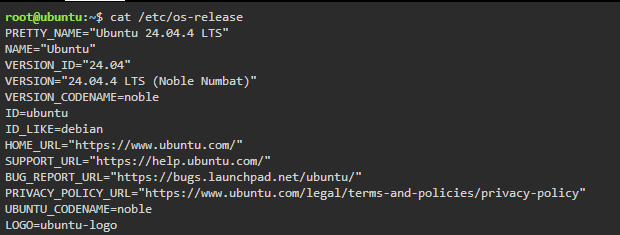
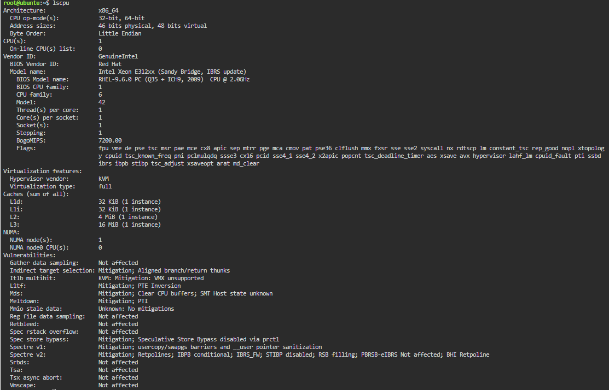
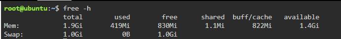
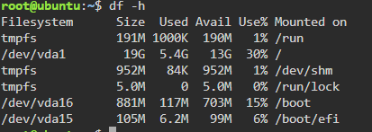

# Checkpoint 7 – Continue Your Linux Investigation

The following information was collected from a KillerCoda Playground using Linux commands.

## Operating System

**Command:** `cat /etc/os-release`

The KillerCoda environment is running **Ubuntu 24.04.4 LTS** (Noble Numbat).

| Field | Value |
| --- | --- |
| Distribution | Ubuntu |
| Version | 24.04.4 LTS (Noble Numbat) |
| Version ID | 24.04 |
| ID | ubuntu |
| ID Like | debian |

## CPU Information

**Command:** `lscpu`

The environment provides **1 virtual CPU** on a KVM hypervisor.

| Field | Value |
| --- | --- |
| Architecture | x86_64 |
| CPU(s) | 1 |
| Vendor | GenuineIntel |
| Model name | Intel Xeon E312xx (Sandy Bridge, IBRS update) |
| Cores per socket | 1 |
| Threads per core | 1 |
| Sockets | 1 |
| Virtualization | KVM |
| Virtualization type | full |

## Memory

**Command:** `free -h`

| Memory Category | Amount |
| --- | ---: |
| Total Memory | 1.9 GiB |
| Used Memory | 419 MiB |
| Free Memory | 830 MiB |
| Shared Memory | 1.1 MiB |
| Buff/Cache | 822 MiB |
| Available Memory | 1.4 GiB |
| Swap Total | 1.0 GiB |
| Swap Used | 0 B |
| Swap Free | 1.0 GiB |

## Disk Space

**Command:** `df -h`

The main root filesystem is `/dev/vda1`.

| Disk Category | Amount |
| --- | ---: |
| Filesystem | `/dev/vda1` |
| Total Size | 19G |
| Used Space | 5.4G |
| Available Space | 13G |
| Usage | 30% |
| Mount Point | `/` |

## Cloud Migration

If this Linux server were migrated to the cloud, it would be hosted as a Linux virtual machine because it is already an Ubuntu server with 1 vCPU, about 1.9 GiB of memory, and a 19 GB root disk.

The equivalent services are:

- **AWS:** Amazon Elastic Compute Cloud (Amazon EC2)
- **Microsoft Azure:** Azure Virtual Machines
- **Google Cloud Platform:** Compute Engine

These three services are the official IaaS virtual-machine offerings that can run an Ubuntu Linux server like the KillerCoda environment.
