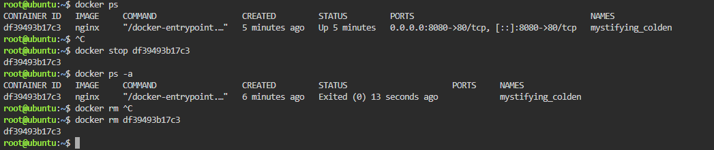

# Checkpoint 5 – The Container Lifecycle

The Nginx container from Checkpoint 4 was still running in the KillerCoda environment. The following Docker commands were used to list it, stop it, confirm that it had stopped, and remove it completely.

## Commands Executed

### 1. List running containers

**Command:** `docker ps`

This command listed the containers that were currently running and showed the Nginx container with ID `df39493b17c3`, name `mystifying_colden`, status `Up`, and host port `8080` mapped to container port `80`.

### 2. Stop the running container

**Command:** `docker stop df39493b17c3`

This command stopped the running Nginx container and printed `df39493b17c3` when the stop completed.

### 3. Verify it is stopped

**Command:** `docker ps -a`

This command listed all containers, including stopped ones, and confirmed that Nginx was no longer running because its status had changed to `Exited (0)`.

### 4. Remove the container completely

**Command:** `docker rm df39493b17c3`

This command deleted the stopped Nginx container so it was no longer stored on the host.

## Evidence

